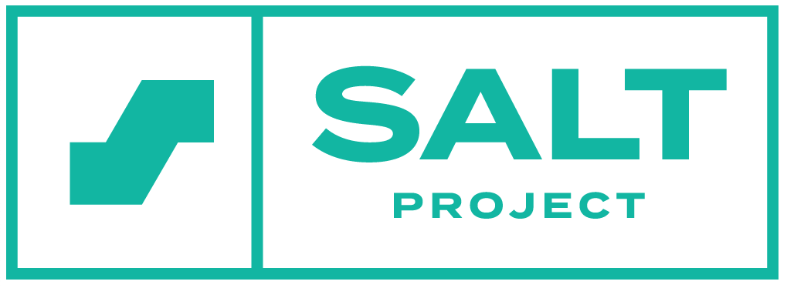
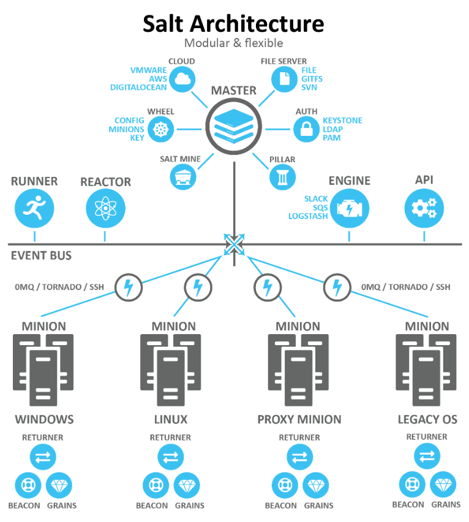

# SaltStack

## Intended learning outcomes:
* Learn what Salt is and how it can be useful
* Learn how to use the software

## What is salt? 

Salt (a.k.a SaltStack) is a python based open-source software. The first release of Salt was in March 2011. Since its release, it has grown in popularity and use. Today Salt can be seen in companies and tools such as Juniper, Cisco, Cloudflare, Nutanix, SUSE, and Tieto.

Salt is a software that simplifies organizations infrastructure regarding their servers.
It is a configuration management and remote execution engine which makes it possible to remotely execute commands across all servers. Thus, Salt is a software that helps organizations to automate and secure their infrastructure. 

An example where it will help a lot to use Salt is if an organization has 100 servers and they all need to be updated to the latest security. It will take a lot of time if someone manually updated all the servers. Instead Salt makes it possible to update all the servers that are connected to the infrastructure from one Master server. 

### Terminology
Master: a Master server is a server that can controll what the other servers (minions) will do. 

Minion: a Minion server is a server that receives configuration and commands from the Master server. The terminology "slave" is another word for minion. 

## Why Salt matters to DevOps

The software Salt is important to DevOps. Being able to manage multiple servers from one server makes it easier to have continuous delivery and a healthy infrastructure throughout the organization's servers. Without such technology as Salt, it would not be possible to have continuous delivery due to the time installing the new updated will take too long (manually updating all the servers).