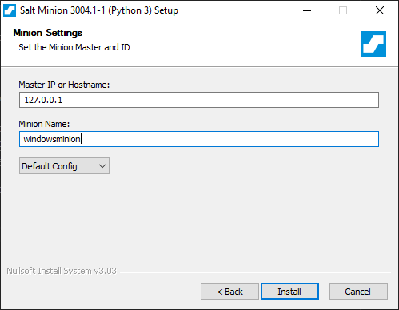

# Installing Salt

### Requirements
* Windows 10
* WSL2 running Ubuntu
* Python 3
* Administrator rights
* Ports 4505 and 4506 free

For this tutorial, we will be only using the Katacoda terminal. The master needs to be installed on a server or VM while the minion can be installed on nearly any operating system. We'll be installing the master and the minion on same machine by using the terminal. The master binds on ports 4505 and 4506 and so they must be available if you are installing on your own machine.

## Installation and configuration
**Note: to make sure everything works properly, we will ensure that the commands have root access by using `sudo`.**

### Installing Salt Master
On the terminal, first updates the packages by using:
```
sudo apt-get update
```

Then install the salt master by using 
```
sudo apt-get install salt-master
```

Don't start the master yet! We will configure it in step 2.


### Installing Salt Minion

Install the Salt Minion package by 
```
sudo apt-get install salt-minion
```

And that's it. We will configure the minion on the next step.


### Installing Salt minion on Windows
**Note: follow these instruction if you will be installing the minion on Windows. Otherwise, jump to the step. If your Master is on the Katacoda terminal, you will need to look up the IP of the Master**

For Windows installations, download the stable branches here for your system:

Python3 x86 (32bit): [Salt-Minion-3004.1-x86-Setup.exe](https://repo.saltproject.io/windows/Salt-Minion-3004.1-Py3-x86-Setup.exe)

Python3 AMD64 (64 bit): [Salt-Minion-3004.1-AMD64-Setup.exe](https://repo.saltproject.io/windows/Salt-Minion-3004.1-Py3-AMD64-Setup.exe)

Follow the instructions on the installer and change the install location if needed. 

When you arrive to the settings screen, the default Master IP will be `salt` and minion name `hostname`. Since we'll be working locally on one machine, we will set Master IP to `127.0.0.1` and minion name to `windowsminion`. Choose `Default Config`.




If you were an admin configuring Salt for a large network, instead of changing the Master IP for every minion installed, you would ideally make it so `salt` would resolve to the IP of the Master. But since we are working locally and on one machine, it is simpler to change the minion setting instead.

