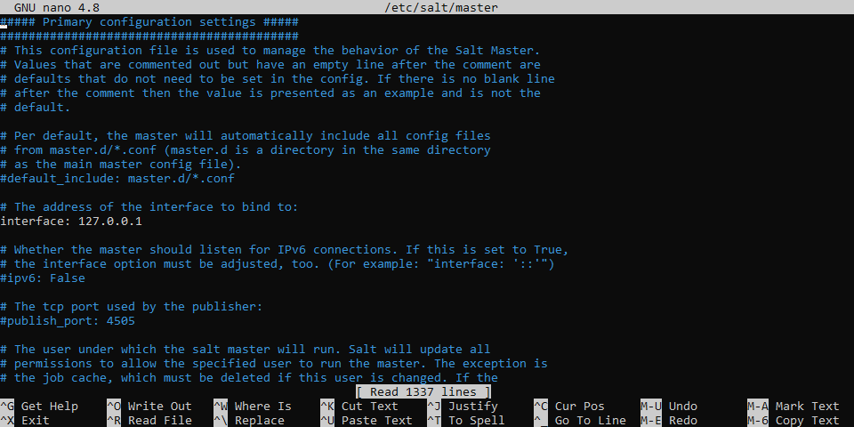

# Configuring the master and minion

Before running the master and minion, we will configure them. 
### Configuring Salt master
On the machine, the configuration file for the master is located at `/etc/salt/master`. Thus, we can open it in nano by: 
```
sudo nano /etc/salt/master
```
Since we installed the Master and Minion on the same machine, we will set the Master IP to the localhost address. Uncomment the `interface` line and change it to `127.0.0.1` as such:



Don't forget to save.

### Configuring Salt minion

The config file for the minion is located at `/etc/salt/minion` and so is opened by 
```
sudo nano /etc/salt/minion
```

Change the `#master:` line to `master: 127.0.0.1`.

Then, scroll down a few pages to the `#id` line. This is what the minion name will show up as. You can name this to your liking. We will change it to `id: alpha`. 
